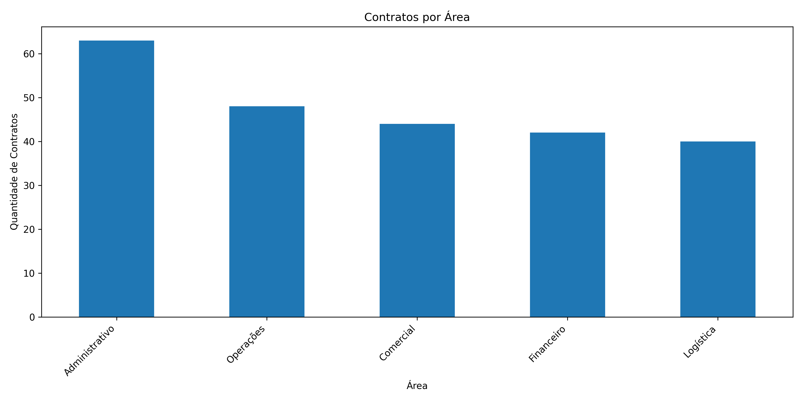
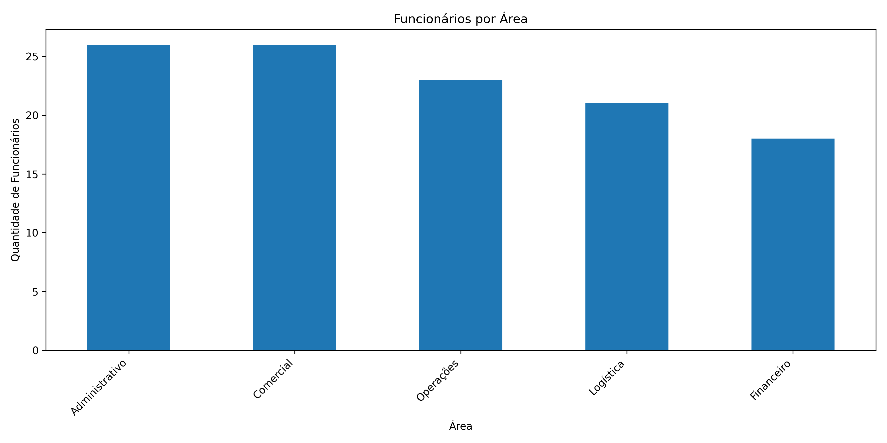

# 📊 Análise de Dados com Pandas

Este projeto tem como objetivo realizar uma **análise exploratória de dados** utilizando a biblioteca **Pandas** no Python.  
Foram utilizadas bases fictícias de funcionários, clientes e serviços prestados para calcular métricas importantes e gerar insights de negócio.

---

## 🚀 Funcionalidades
O projeto realiza os seguintes cálculos e análises:

1. **Folha Salarial**
   - Cálculo do custo total da folha salarial da empresa.

2. **Faturamento da Empresa**
   - Cálculo do faturamento total a partir dos contratos fechados.

3. **Percentual de Funcionários que Fecharam Contrato**
   - Percentual de colaboradores envolvidos diretamente em vendas.

4. **Contratos por Área**
   - Quantidade de contratos fechados por área da empresa (com gráfico).

5. **Funcionários por Área**
   - Distribuição dos funcionários por área (com gráfico).

6. **Ticket Médio**
   - Valor médio mensal dos contratos dos clientes.

---

## 🛠️ Tecnologias Utilizadas
- [Python 3.11+](https://www.python.org/)
- [Pandas](https://pandas.pydata.org/)
- [Matplotlib](https://matplotlib.org/)
- [OpenPyXL](https://openpyxl.readthedocs.io/)
- [Excel](https://www.microsoft.com/pt-br/microsoft-365/excel)

---

## 📂 Estrutura do Projeto

📦 projeto-pandas
- 📄 projeto.ipynb # Notebook principal com análises e gráficos
- 📄 CadastroFuncionarios.csv → Base de dados dos funcionários  
- 📄 CadastroClientes.csv → Base de dados dos clientes 
- 📄 BaseServiçosPrestados.xlsx → Base de serviços prestados  
- 📄 requirements.txt # Dependências do projeto
- 📄 README.md # Documentação do projeto

---

## 📊 Gráficos do Projeto

### Contratos por Área


### Funcionários por Área


---

## 📈 Exemplos de Análises Realizadas

- Limpeza de colunas desnecessárias na base de funcionários
- Junção de tabelas para cruzar informações de contratos e áreas
- Contagem de quantidade de contratos por área
- Geração de gráficos em barras para visualização de dados

---

## ▶️ Como Executar o Projeto

1. Clone este repositório:
   ```bash
   git clone https://github.com/yagofelix00/data-analysis-clientes-servicos.git

   
2. Acesse a pasta do projeto:
   cd data-analysis-clientes-servicos

3. Instale as dependências:
   pip install -r requirements.txt

4. Execute o notebook:
   jupyter notebook projeto.ipynb
   Se você usa o VS Code, pode abrir o arquivo .ipynb direto no editor.

5. Certifique-se de que os arquivos de dados estão na mesma pasta do notebook:

   - CadastroClientes.csv

   - CadastroFuncionarios.csv

   - BaseServicosPrestados.xlsx


📌 Observações

- Certifique-se de ter o Python e o Jupyter Notebook instalados.
- Todos os arquivos de dados devem estar na mesma pasta que o notebook para que o código funcione corretamente.
- Os dados utilizados são fictícios, apenas para fins de estudo.
- Este projeto foi desenvolvido para praticar manipulação de dados, análise exploratória e visualização com Python.

👤 Autor
Yago Félix

💼 Desenvolvedor Python Júnior (Back-end / Full Stack)
📂 Mais projetos em GitHub: [https://github.com/yagofelix00](https://github.com/yagofelix00)